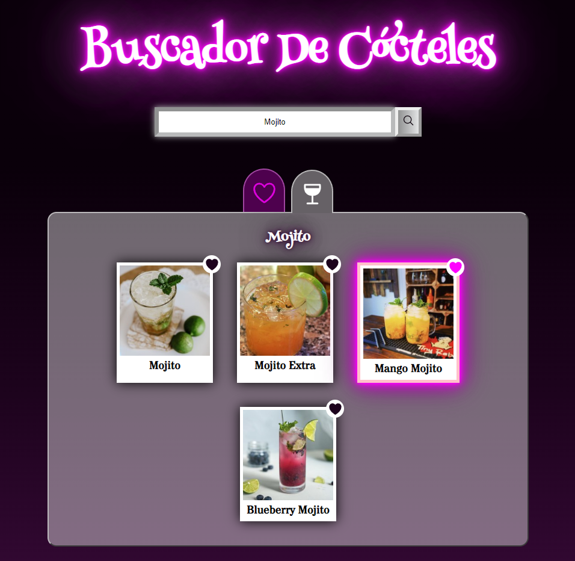

<h1 align="center"> 🍸 Buscador De Cócteles 🍹</h1>

## 👋 Bienvenid@! {#proyecto}

Este proyecto consiste en una aplicación web que contiene un listado de las bebidas y cócteles de todo el mundo, que puedes buscar, des/marcar como favoritos y guardarlos en local storage.

  

#### Links 📌

- [Repositorio en GitHub](https://github.com/ElenaPalomar/cocktails-browser)
- [Buscador de cócteles](https://elenapalomar.github.io/cocktails-browser/)

## :bookmark_tabs: Índice

- [El proyecto](#proyecto)
  - [Links](#links)
- [Descripción](#descripcion)
  - [Inicio](#inicio)
  - [Buscar](#buscar)
  - [Agregar/quitar de favoritos](#favoritos)
  - [Listado de favoritos](#lista-favoritos)
  - [Almacenamiento Local](#almacenamiento-local)
  - [Errores](#errores)
- [Requisitos para poder trabajar con el proyecto](#requisitos)
  - [Instalación](#instalacion)
- [Construido con](#construido-con)
- [Autora](#autora)

## 📄 ¿Qué puedes esperar de este proyecto? {#descripcion}

### Inicio :clapper: {#inicio}

En un primer momento, la página muestra un listado aleatorio de cócteles y un buscador.

Desde este momento ya se puede realizar una búsqueda del cóctel por el que sientas curiosidad, añadir o quitar cualquiera de los cócteles que se muestran a favoritos y echar un vistazo a los que ya tenía guardados haciendo click en la pestaña que se identifica con un corazón (favoritos).

### Buscar :mag: {#buscar}

Al hacer clic sobre el botón de Buscar, la aplicación se conecta al API <a href="https://www.thecocktaildb.com" target="_blank">TheCocktailDB</a> y devuelve un listado de los cócteles que contienen la palabra que el usurio haya escrito en el cuadro de texto.

### Agregar/quitar de favoritos :heart: / :broken_heart: {#favoritos}

Cada uno de los cócteles que se renderizan tiene un corazón en la esquina superior derecha, en el cual puedes hacer click y señalar que ese cóctel es tu favorito o que ha dejado de serlo. Cuando pulsas el corazón ocurren dos cosas: el cóctel se cambia su apariencia visual y se añade a la lista de favoritos.

### Listado de favoritos :heart_decoration: {#lista-favoritos}

Hasta ahora hemos estado viendo la página principal en la que se ven los cócteles por defecto o los que hemos buscado, pero, si nos desplazamos a la pestaña de favoritos tendremos un listados de cócteles que hemos seleccionado nosotros. Cada uno de éstos tiene un botón para eliminarlo de la lista de favoritos y, al final de la misma, un botón para eliminarlos todos a la vez.

### Almacenamiento Local :package: {#almacenamiento-local}

Para que nos perdamos nuestra lista al recargar la página o al volver a ella después de cerrarla, los datos quedan almacenados en el <em>local storage</em>, o lo que es lo mismo, en el almacenamiento local de nuestro navegador.

### Errores :warning: {#errores}

Entre otros mucho, hay varios errores que se pueden dar al navegar por la aplicación web, por lo que se ha buscado una forma de avisar al usuario:
<ul>
  <li>Al obtener los datos de los cóctles, puede haber alguna imagen que este rota o que simplemente no haya imagen. Por lo que se ha añadido una imagen por defecto para estos casos.</li>
  <li>Cuando el usuario no introduce ningún nombre en el cuadro de texto y presiona el botón de buscar, la página muestra un error indicando al usuario que debe rellenar ese campo para que pueda continuar.</li>
  <li>Lo mismo pasa si el usuario pone un nombre que no coincide con ninguno de los elementos que contiene la base de datos. En ambos caso la página ofrece un botón para volver a la página principal.</li>
  <li>Cuando ocurre un error al pedir los datos al API, ésta nos devuelve un mensaje para intentarlo nuevamente, pues se trataría de un problema de conexión con la misma.</li>
</ul>

## 📋 Requisitos para poder trabajar con el proyecto {#requisitos}

Para poder trabajar con este proyecto, además de clonar o descargar el mismo, hay que tener en cuenta que utiliza un conjunto de paquetes o librerias diseñado por Adalab.

### Instalación ⚙️ {#instalacion}

Lo primero que debes hacer es escribir en la consola, dentro de la carpeta en la que se encuentra el proyecto:

`npm install`

pues que las dependencias que necesitas ya están referidas en el archivo <code>package.json</code> y sólo debes instalarlas en tu entorno local.

Para previsualizar los cambios que vayas realizando tendrás que escribir el siguiente código en la consola:

`npm start`

que abrirá la aplicación web en una nueva pestaña de tu navegador predeterminado.

Finalmente, para subir los cambios realizados a un servidor, se recomienda actualizar la versión de producción de nuestro proyecto que se encuentra en la carpeta <code>docs</code>. Para ello, usamos el comando:

`npm start`

que borra la carpeta anterior con el mismo nombre (si la había) y la vuelve a crear de nuevo con el proyecto actualizado.

## 🛠️ Construido con {#construido-con}

- HTML5 
- Sass 
- Flexbox
- Diseño _responsive_
- Flujo de trabajo _Mobile-first_
- JavaScript 
- Gulp 

## ✒️ Autora {#autora}

- LinkedIn - [elena-palomar](https://www.linkedin.com/in/elena-palomar/)
- GitHub - [ElenaPalomar](https://github.com/ElenaPalomar)
